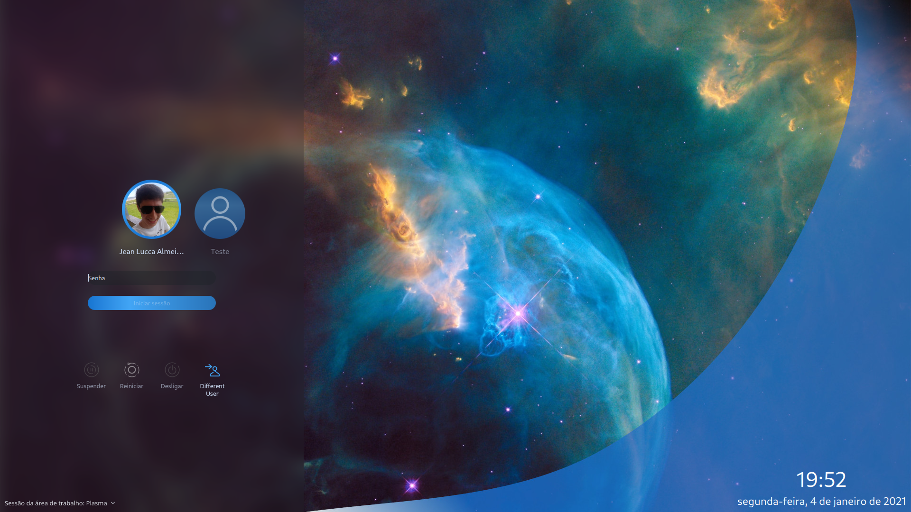

## ArchBlueSpace SDDM Theme ##

### [EN] ###
  - Based on the amazing job of [Eliver Lara's Sweet](https://github.com/EliverLara/Sweet/tree/nova/kde/sddm)
  - Just a recolor and changed the background image...
  - Still developing, awaiting for updates...
  - Background image taken from [Nasa](https://www.nasa.gov/feature/nasa-is-taking-a-new-look-at-searching-for-life-beyond-earth) - Credit: NASA, ESA, and the Hubble Heritage Team (STScI/AURA), F. Summers, G. Bacon, Z. Levay, and L. Frattare (Viz 3D Team, STScI)
---
### [PT-BR] ###
 - Baseado no trabalho incrível [Eliver Lara's Sweet](https://github.com/EliverLara/Sweet/tree/nova/kde/sddm)

  - Apenas um recolor e alteração no wallpaper...
  - Ainda está em Desenvolvimento, aguardando updates...
  - Imagem de fundo retirada de [Nasa](https://www.nasa.gov/feature/nasa-is-taking-a-new-look-at-searching-for-life-beyond-earth) - Créditos: NASA, ESA, and the Hubble Heritage Team (STScI/AURA), F. Summers, G. Bacon, Z. Levay, and L. Frattare (Viz 3D Team, STScI)
---
---
### Preview ###

